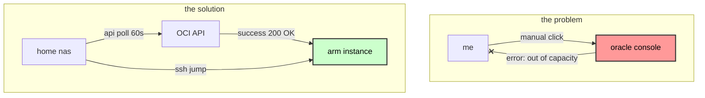
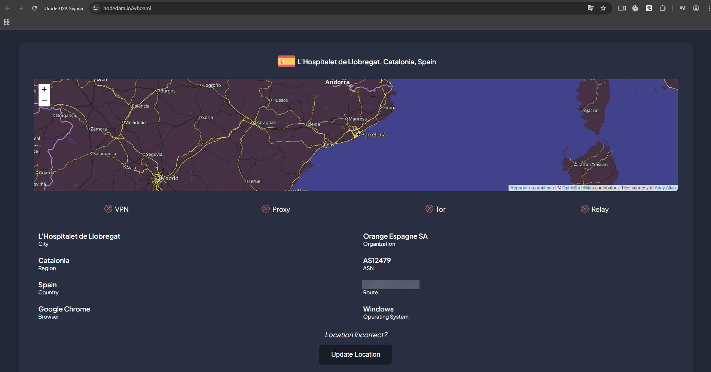
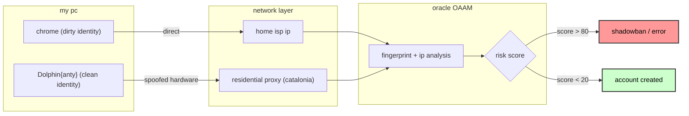

# how i got 8 ocpus and 48gb ram for $4.84: exploiting oracle cloud's free tier

### **date:** jan 25, 2026
### **topic:** cloud automation, anti-fingerprinting, resource arbitration
### **page:** microck.github.io/oracle-sniper

---

### tl;dr
oracle cloud offers free arm servers. getting one is harder than finding a printer that works. the "out of host capacity" error is a lie designed to make you quit. i didn't want to click "create" manually for six months. so, i built a multi-region, 24/7 autonomous sniper that lives on my nas, routes traffic through a stealth identity layer to bypass oracle's aggressive fraud detection (OAAM), and manages multiple accounts without them ever linking back to my home ip.

---

### the objective
the goal was simple: get the maxed-out free ARM instance (VM.Standard.A1.Flex). the reality was painful. every time i tried to create an instance in a popular region like ashburn or frankfurt, i was met with the dreaded 500 error.


*the boss fight: oracle's polite way of saying "go away"*

i realized this wasn't a technical error; it was a resource contention issue. thousands of users and bots were fighting for the same freed-up server slots. to win, i needed persistence. i needed speed. and because oracle limits one account per person, i needed a way to double my odds without getting banned.

**my logic:**
1.  **automation**: a script that hammers the API 24/7.
2.  **evasion**: a way to run a second account for double the chance without oracle linking it to my main account.
3.  **isolation**: a secure way to access the instances once created without leaking my ip.



### phase 0: reconnaissance & the graveyard of failed accounts
before the success, there was a lot of failure. oracle's security team isn't stupid. they know people want free compute. i spent 48 hours mapping their defenses.

my first attempt was lazy. i fired up nordvpn and a privacy.com virtual card.
**result:** `Error processing transaction`.
**analysis:** oracle subscribes to ip reputation feeds. datacenter ips are flagged instantly. virtual bin numbers are blacklisted.

attempt two: legitimate residential ip, but standard chrome incognito mode.
**result:** shadowban. the account was created, but "out of capacity" errors persisted even when capacity was available.
**analysis:** i checked my browser fingerprint on `pixelscan.net`. my canvas hash and webgl renderer (nvidia rtx 4090) were unique identifiers. oracle linked my new "spanish" identity to my old "french" account because they shared the same gpu signature.

i realized i needed to decouple my physical location from my digital one. i tested three providers: iproyal (cheap but slow), dexodata (good budget option), and decodo.

decodo was the winner. 40m+ ips. i could target specific cities. mimicking a user in catalonia while actually being in paris required low-latency residential relays.


*convincing the internet i am in catalonia*

**the golden rule discovered:** consistency is key.
spanish card + us ip = **ban**.
spanish card + spanish ip (proxy) + spanish phone = **success**.

oracle's fraud model (OAAM) calculates a "risk score". if the geo-distance between your ip and billing address is > 500km, the score spikes. if your browser timezone doesn't match your ip timezone, score spikes. my final setup aligned every single vector to zero out that score.

### phase 1: the identity firewall
before i could even think about the script, i had to solve the identity problem. oracle uses **Oracle Adaptive Access Manager (OAAM)**, a military-grade fraud detection system. it tracks browser fingerprints, network reputation, typing behavior, and payment consistency.

if i just opened a new incognito tab and signed up for a second account, OAAM would see my canvas hash, match my ip to my existing account, and shadowban me instantly.

**the clean room protocol**
i couldn't use my computer. i couldn't use my browser. i had to become a ghost.

i used **Dolphin{anty}**. this isn't just a browser; it's a fingerprint spoofer. it generates a fake "noise" over my canvas and WebGL readouts, making my high-end pc look like a generic office laptop.


*generating a new digital soul in dolphin*

vpns are dead. oracle knows every datacenter ip range. i bought 1gb of residential proxy data. these ips belong to real comcast/at&t home modems. to oracle, i was just a guy in catalonia.

i configured the proxy to hold the same ip for 30 minutes ("sticky session"). if my ip rotated from barcelona to madrid in the middle of the credit card form, the fraud score would spike.



### phase 2: the sniper mechanism
with the account secured, i needed the weapon. manual creation was futile. i needed something that would sleep, retry, and strike the millisecond a slot opened.

i adapted a python script (`main.py`) to run on my local nas.

**the loop of persistence:**
authentication uses an api key to sign requests, bypassing the ui and its captchas entirely. it targets `VM.Standard.A1.Flex` with 4 ocpus and 24gb ram. every 60 seconds, it sends a `launch_instance` request.

if it gets `500 Internal Server Error`, it sleeps. if it gets `200 OK`, it sends me a discord notification.


*gotcha. the moment the sniper fired.*

i didn't want to leave my pc on. i deployed this to my home server using a simple directory structure, running each account independently inside a `nohup` process. effectively creating a distributed botnet of one.

### phase 3: the stealth link (ssh jump host)
this was the final piece of the puzzle. i had two accounts: paris (created years ago, accessed from home) and ashburn (created via proxy, "located" in catalonia).

if i ssh'd into account B directly from my home ip, oracle's security logs would see the same ip accessing both accounts. linkage confirmed. ban hammer dropping.

**the solution: ssh tunneling**
i used my legitimate paris instance as a "jump host" to access the new ashburn instance.

```bash
# ~/.ssh/config

# the "legit" path
Host oracle-paris
    HostName 141.145.xxx.xxx
    User ubuntu

# the "stealth" path
Host oracle-ashburn
    HostName 10.0.0.x  # public ip of ashburn
    User ubuntu
    ProxyJump oracle-paris
```

when i type `ssh oracle-ashburn`, my nas connects to paris. paris opens a tunnel to ashburn. ashburn sees an incoming connection from **paris ip**, not my home ip.

this keeps the identities completely isolated. account B never sees my real fingerprint.

### conclusion
cloud providers are building higher walls to stop free-tier abuse. they use behavioral biometrics, residential ip filters, and canvas fingerprinting. but resource contention is the great equalizer.

by combining anti-detect browsers to pass the door check, residential proxies to fake the id, and api automation to wait in line for you, you can defeat the "out of capacity" boss.

i now have 8 OCPUs and 48GB of RAM running 24/7 for $0.00. the sniper is still running, waiting for the next slot to open.


*in. account created successfully. the sniper is now active.*


*total cost: $4.84. cheaper than a latte.*

***

### appendix: the toolkit

**the sniper script:**
[main.py](main.py) - *don't abuse this.*

**the proxy provider:**
i used decodo (formerly smartproxy). their "sticky session" feature is mandatory for the signup flow.

**the browser:**
dolphin{anty}. free for 10 profiles. it handles the webgl noise injection better than manual plugin hacking.
