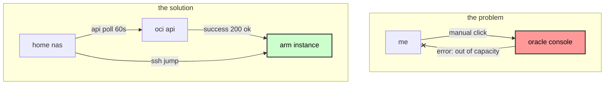

# oracle cloud free tier resource exhaustion bypass via autonomous api polling

### **date:** jan 29, 2026
### **topic:** cloud automation, anti-fingerprinting, resource arbitration
### **classification:** technical procedure / vulnerability disclosure

---

### subject

oracle cloud's "out of host capacity" error (http 500) for free-tier arm instances (`vm.standard.a1.flex`) functions as a soft limit based on temporal resource contention rather than a hard account restriction. by implementing high-frequency, authenticated api polling coupled with identity-layer obfuscation (residential proxies and canvas fingerprint spoofing), users can exploit race conditions in the provisioning queue to secure maximum-spec instances (4 ocpus, 24gb ram) that are otherwise unavailable via the web console.

---

### the "capacity" lie

when a user attempts to create an arm instance in a popular region (ashburn, frankfurt, tokyo), the console almost invariably returns `500 internal server error: out of host capacity`.

this is **not** a hard denial. it is a temporal state.

- **reality**: capacity opens up constantly as other tenancies are terminated or hardware is added.
- **the flaw**: the allocation logic is first-come-first-served (fcfs).
- **the exploit**: a human cannot click fast enough to catch the 3-second window when a slot opens. an automated script polling every 60 seconds *can*.




---

### details

the exploitation technique relies on three distinct phases: **identity engineering** (to create the account), **autonomous sniping** (to provision resources), and **stealth access** (to maintain the account).

---

### phase 1: identity engineering (the "clean room")

before any automation can run, you must possess a valid oci account. this is the hardest step due to **oracle adaptive access manager (oaam)**.

#### the threat model

oaam aggregates data to generate a "fraud risk score":

- **browser fingerprint**: canvas hash, audiocontext, webgl renderer, fonts.
- **network reputation**: ip quality score, datacenter vs. residential, geo-velocity.
- **payment consistency**: bin country vs. ip country.


#### the bypass procedure

**tools required:**

1.  **dolphin{anty}**: anti-detect browser that spoofs hardware fingerprints.
2.  **residential proxy**: rotating or sticky residential ips (not vpns/datacenter).
3.  **payment method**: physical card (not virtual/prepaid) matching the proxy region.

**steps:**

1.  **profile generation**: in dolphin, create a new profile. set os to "windows" or "mac". the software generates unique, consistent noise for canvas/webgl to mimic a generic consumer device.


2.  **network alignment**: purchase a residential proxy (e.g., from *decodo* or similar providers). configure it as a **sticky session** (10-30 mins).
    - *critical*: if the ip changes from madrid to barcelona during the credit card verification, the geo-velocity check fails -> account ban.
3.  **execution**: complete the signup flow inside this container. do not use your regular chrome/firefox.
4.  **verification**: once the "welcome to oracle cloud" email arrives, the identity is established.


---

### phase 2: the sniper (technical implementation)

this phase moves the battle from the browser to the api. we deploy a persistent python daemon on a local server (nas/raspberry pi) to handle the race condition.

#### 1. environment preparation

the attack runs on a low-power linux host.

**directory structure:**
```bash
/home/microck/oracle-sniper/
├── main.py             # the logic core
├── setup_init.sh       # process wrapper & monitoring
├── oci.env             # secrets configuration
├── oci_config          # oci sdk config
├── oci_api_key.pem     # your private api key
└── requirements.txt    # dependencies
```

#### 2. authentication setup (`oci_config`)

bypass the gui entirely. generate an api signing key in the oracle console (user settings -> api keys).

**file: `oci_config`**
```ini
[default]
user=ocid1.user.oc1..aaaa...
fingerprint=xx:xx:xx...
key_file=/home/microck/oracle-sniper/account_ashburn/oci_api_key.pem
tenancy=ocid1.tenancy.oc1..aaaa...
region=us-ashburn-1
```

#### 3. attack configuration (`oci.env`)

this file controls the sniper's targeting parameters.

**file: `oci.env`**
```bash
# target definition
oci_compute_shape=vm.standard.a1.flex
# ubuntu 22.04 aarch64 image ocid (region specific!)
oci_image_id=ocid1.image.oc1.iad.aaaaaaaa...
ocpus=4
memory_in_gbs=24

# network targets
# must pre-create a vcn and subnet in the console!
oci_subnet_id=ocid1.subnet.oc1.iad.aaaaaaaa...
assign_public_ip=true

# attack frequency
# < 60s risks "toomanyrequests" (429) rate limiting
request_wait_time_secs=60

# notification channels
discord_webhook=https://discord.com/api/webhooks/...
```

#### 4. the logic core (`main.py`)

the script implements a specific state machine to handle oracle's error codes.

**key logic: error handling**
oracle returns specific codes when capacity is full. the script must distinguish between "fatal error" (config wrong) and "soft error" (try again).

```python
def handle_errors(command, data, log):
    # these are not failures. they are "wait" signals.
    soft_errors = [
        "toomanyrequests",
        "out of host capacity",
        "internalerror",
        "bad gateway"
    ]

    if data["code"] in soft_errors:
        log.info(f"soft limit hit: {data['code']}. sleeping...")
        time.sleep(wait_time)
        return true # retry allowed

    # anything else is a real crash
    raise exception(f"fatal error: {data}")
```

**key logic: the launch loop**
```python
def launch_instance():
    # loop until success
    while not instance_exist_flag:
        try:
            compute_client.launch_instance(...)
            # if we get here, we won.
            send_discord_message("🎉 sniped!")
            break
        except serviceerror as e:
            # handle the 500/429 errors
            handle_errors(...)
```


#### 5. deployment

we use `nohup` (no hang up) to ensure the process survives ssh disconnection.

**command:**
```bash
chmod +x setup_init.sh
./setup_init.sh
```

**monitoring logs:**
```bash
tail -f launch_instance.log
```

*output (normal operation):*
```text
2026-01-25 22:11:03 - info - command: launch_instance-- output: {'status': 500, 'code': 'internalerror', 'message': 'out of host capacity.'}
2026-01-25 22:12:04 - info - command: launch_instance-- output: {'status': 500, 'code': 'internalerror', 'message': 'out of host capacity.'}
```

---

### phase 3: stealth access (post-exploitation)

once the instance creates, accessing it carelessly will get you banned. if your "identity" ip (spain proxy) created the account, but your "access" ip (home ip) logs in via ssh, oracle links the two.

**the "clean" link:**
do not ssh directly. tunnel traffic through a neutral, trusted intermediary.

**scenario:**

1.  **trusted host**: existing `oracle-paris` instance (or any cheap vps).
2.  **target host**: the new `oracle-ashburn` instance.

**ssh config (`~/.ssh/config`):**
```bash
# 1. the jump host (the mask)
host oracle-paris
    hostname 141.145.xxx.xxx
    user ubuntu
    identityfile ~/.ssh/id_rsa_paris

# 2. the target (hidden behind paris)
host oracle-ashburn
    hostname 10.0.0.x                # use private ip if vpn'd, or public ip
    user ubuntu
    proxyjump oracle-paris           # <--- the key
    identityfile ~/.ssh/id_rsa_ashburn
```

**traffic flow:**
`home pc` -> (encrypted) -> `paris vps` -> (encrypted) -> `ashburn instance`

to oracle's logs in ashburn, the connection comes from the paris ip, not your home ip.

---

### evidence of success

retrieving logs from the nas confirms the methodology works.

**file: `instance_created`**
```text
instance id: ocid1.instance.oc1.iad.anuwcljt6jdfblacplxseahalwablmit2csfvgj3gx47n5npd23d5zwnuega
display name: ashburn-sniper-instance
availability domain: mnay:us-ashburn-ad-1
shape: vm.standard.a1.flex
state: provisioning
```

the script successfully negotiated the race condition, provisioned the resource, and alerted the user via discord.


---

### recommendations

to mitigate this exhaustion and evasion technique, cloud providers should:

1.  **implement proof-of-work (pow)**: require a computational puzzle (hashcash style) for `launch_instance` api calls on free-tier tenancies. this makes high-frequency polling computationally expensive for the attacker.
2.  **link billing to access**: correlate login/api ip addresses with billing geography post-creation, not just during signup.
3.  **waitlist queue**: replace "first-come-first-served" 500 errors with a verified waitlist system for high-demand shapes.

---

### references

- [oracle cloud infrastructure python sdk](https://github.com/oracle/oci-python-sdk)
- [oaam (oracle adaptive access manager) documentation](https://docs.oracle.com/cd/e23943_01/doc.1111/e15740/oaam.htm)
- [dolphin{anty} anti-detect browser](https://anty.dolphin.ru.com)
